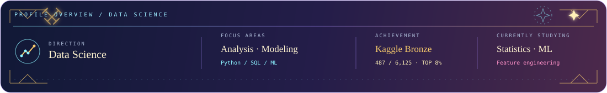

  

# 雨乐 | Rainfun

### 数据科学学习者 · Data Science Learner

以数据分析、统计建模和机器学习为主要方向，持续学习并积累项目实践。

DATA SCIENCE · MODELING · RESEARCH · BUILDING

  

  

<table>
  <tr>
    <td valign="top" width="55%">
      <h2>关于我 / About</h2>
      
我叫 Rainfun，目前专注于数据科学方向，正在系统学习数据分析、统计建模和机器学习。

      
<b>专业方向：</b>数据分析 · 预测建模 · 数据可视化

      
<b>实践方式：</b>竞赛 · 项目 · 持续学习

    </td>
    <td valign="top" width="45%">
      <h2>职业志向 / Direction</h2>
      
希望成长为能够独立完成数据分析、机器学习建模和数据应用的数据科学从业者。

      
长期关注真实问题中的数据分析与预测建模。

    </td>
  </tr>
</table>

## 当前研究与学习 / Current Focus

<table>
  <tr>
    <td valign="top" width="50%"><b>01 · 数据分析</b> Python · Pandas · SQL 数据清洗、探索性分析、可视化</td>
    <td valign="top" width="50%"><b>02 · 统计建模</b> 特征工程 · 交叉验证 模型比较、误差分析、结果解释</td>
  </tr>
  <tr>
    <td valign="top" width="50%"><b>03 · 机器学习</b> 分类 · 回归 · 预测 竞赛方案、模型训练、实验复盘</td>
    <td valign="top" width="50%"><b>04 · 数据应用</b> Jupyter · Power BI · Git 分析项目、数据工具、可视化交付</td>
  </tr>
</table>

## 技术基础 / Technical Foundation

  
  
  
  
  
  

  

## 代表性项目 / Selected Work

<table>
  <tr>
    <td valign="top" width="50%">
      <h3>ROGII · 井筒地质预测</h3>
      
地质预测竞赛项目，完成数据探索、特征构造、模型训练与提交。

      
<b>Kaggle 铜牌 · 487 / 6,125 · Top 8%</b>

      <a href="https://github.com/hccccc01333/rogii-487th-place-solution">查看项目 ↗</a>
    </td>
    <td valign="top" width="50%">
      <h3>KPLdata · 比赛数据分析</h3>
      
围绕赛程数据、实时胜率预测和比赛复盘进行分析。

      
<b>数据采集 · 预测分析 · 可视化</b>

      <a href="https://github.com/hccccc01333/KPLdata">查看项目 ↗</a>
    </td>
  </tr>
  <tr>
    <td valign="top" width="50%">
      <h3>DSH Excel Chat · 数据工具</h3>
      
通过对话创建、编辑、修复和验证 Excel，探索数据工具自动化。

      
<b>表格处理 · 代理评估 · 自动验证</b>

      <a href="https://github.com/hccccc01333/dsh-excel-chat">查看项目 ↗</a>
    </td>
    <td valign="top" width="50%">
      <h3>Power BI · 零售经营分析</h3>
      
围绕零售数据建立分析模型，完成经营指标、复购和异常分析。

      
<b>数据建模 · 指标分析 · 商业可视化</b>

      <a href="https://github.com/hccccc01333/powerbi-retail-analysis">查看项目 ↗</a>
    </td>
  </tr>
</table>

## 成就 / Achievement

<table>
  <tr>
    <td width="90" align="center">🥉 BRONZE</td>
    <td><b>ROGII - Wellbore Geology Prediction</b> 487 / 6,125 teams · Code Competition · Top 8%</td>
    <td align="right"><a href="https://www.kaggle.com/competitions/rogii-wellbore-geology-prediction">Kaggle ↗</a></td>
  </tr>
</table>

## 诗词 / Poetry

**毛泽东 ·《七律·到韶山》** 
*Mao Zedong · “Qilu · To Shaoshan”*

> 为有牺牲多壮志，敢教日月换新天。 
> *For sacrifice gives rise to a mighty will; we dare to make a new world beneath the sun and moon.*

## 研究路线 / Research Path

<b>数据分析基础</b>　→　<b>统计方法</b>　→　<b>机器学习建模</b>　→　<b>数据产品实践</b>

当前重点：完善 Python 与 SQL 能力，深入学习统计建模、特征工程、模型评估和结果解释。

[个人网站](https://hccccc01333.github.io/) · [Kaggle](https://www.kaggle.com/afterrain42) · [全部项目](https://github.com/hccccc01333?tab=repositories)

 
✦ DATA SCIENCE · CONTINUOUS LEARNING · LONG-TERM BUILDING ✦

