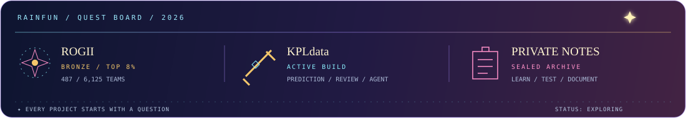
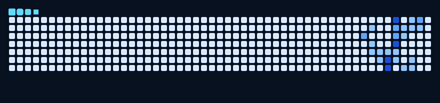

<p align="center">
  
</p>

<div align="center">

# Rainfun · Data Science Adventurer

用 Python、SQL 与机器学习，把问题拆开、验证，再变成可复现的结论。

[](https://hccccc01333.github.io/)
[](https://github.com/hccccc01333)
[](https://www.kaggle.com/afterrain42)

</div>

<p align="center">
  <sub>✦ RAINFUN'S FIELD NOTES · DATA · EXPERIMENTS · BUILDING</sub>
</p>

## 冒险者档案

<table>
  <tr>
    <td width="25%"><b>职业</b><br />Data Science Learner</td>
    <td width="25%"><b>主属性</b><br />分析 · 建模 · 可视化</td>
    <td width="25%"><b>当前任务</b><br />构建可复现的分析作品</td>
    <td width="25%"><b>战绩</b><br />Kaggle 铜牌 · 487 / 6125</td>
  </tr>
</table>

> 我关注的不只是“模型能不能跑”，也关注数据从哪里来、结论是否可信，以及结果能不能被别人复现和使用。

## 当前主线

```text
问题定义  →  数据清理  →  探索与可视化  →  建模验证  →  解释与交付
```

<p align="center">
  
</p>

| 方向 | 我正在积累的能力 |
| --- | --- |
| 数据分析 | 缺失值、异常值、特征关系、分组对比与业务指标拆解 |
| 机器学习 | 特征工程、交叉验证、模型比较、误差分析与结果解释 |
| 数据产品 | 把脚本、Notebook 和实验过程整理成可复用的小工具 |

## 能力树

<p align="center"><sub>✧ OBSERVE · CAST · DELIVER ✧</sub></p>

<table>
  <tr>
    <td valign="top" width="33%">
      <h3>⌁ 观测</h3>
      <p>Python · SQL · Pandas<br />数据清洗 · EDA · 指标分析</p>
    </td>
    <td valign="top" width="33%">
      <h3>✧ 施法</h3>
      <p>scikit-learn · Jupyter<br />特征工程 · 预测建模 · 评估</p>
    </td>
    <td valign="top" width="33%">
      <h3>⚔ 交付</h3>
      <p>可视化 · Power BI · Git<br />实验记录 · 文档 · 复现</p>
    </td>
  </tr>
</table>

## 作品任务

<p align="center"><sub>⚔ SELECTED EXPEDITIONS / PUBLIC WORKS ⚔</sub></p>

<table>
  <tr>
    <td valign="top" width="50%">
      <h3>⚔ ROGII · 井筒地质预测</h3>
      <p>从数据探索、特征构造到模型验证的完整竞赛实践。</p>
      <p><b>结果：</b>Kaggle 铜牌，487 / 6,125 队伍，Top 8%。</p>
      <a href="https://github.com/hccccc01333/rogii-487th-place-solution">查看项目 ↗</a>
    </td>
    <td valign="top" width="50%">
      <h3>✧ KPLdata · 比赛数据实验室</h3>
      <p>围绕赛程采集、实时胜率预测与复盘分析搭建的数据项目。</p>
      <p><b>关键词：</b>数据管道 · 预测 · 可视化 · AI Agent</p>
      <a href="https://github.com/hccccc01333/KPLdata">查看项目 ↗</a>
    </td>
  </tr>
  <tr>
    <td valign="top" width="50%">
      <h3>⌘ DSH Excel Chat · 表格智能操作</h3>
      <p>通过对话创建、编辑、修复和验证 Excel，关注自动化过程中的可靠性。</p>
      <p><b>关键词：</b>代理评估 · 结构化编辑 · 自动验证</p>
      <a href="https://github.com/hccccc01333/dsh-excel-chat">查看项目 ↗</a>
    </td>
    <td valign="top" width="50%">
      <h3>◈ Power BI · 零售经营分析</h3>
      <p>从星型模型到经营看板，练习把原始数据转化为可读的决策信息。</p>
      <p><b>关键词：</b>数据建模 · 同比环比 · 复购 · 异常识别</p>
      <a href="https://github.com/hccccc01333/powerbi-retail-analysis">查看项目 ↗</a>
    </td>
  </tr>
</table>

## Kaggle 战绩

<p align="center"><sub>🥉 PROOF OF WORK · COMPETITION RECORD</sub></p>

<table>
  <tr>
    <td width="90" align="center">🥉<br /><sub>BRONZE</sub></td>
    <td>
      <b>ROGII - Wellbore Geology Prediction</b><br />
      487 / 6,125 teams · Code Competition · Top 8%
    </td>
    <td align="right"><a href="https://www.kaggle.com/competitions/rogii-wellbore-geology-prediction">查看比赛 ↗</a></td>
  </tr>
</table>

## 学习进度

| 已建立 | 正在强化 | 下一阶段 |
| --- | --- | --- |
| Python / SQL 基础、数据清洗、Notebook 实验 | 统计建模、特征工程、模型解释 | 更完整的数据产品与端到端部署 |

我的学习笔记会保存在私有仓库中，公开主页只展示已经整理成作品的内容。

## 公会记录

<p align="center">
  
  
</p>

<p align="center">
  
</p>

## 贡献记录

<p align="center">
  
</p>

<div align="center">

✦ [访问个人网站](https://hccccc01333.github.io/) · [查看全部仓库](https://github.com/hccccc01333?tab=repositories) ✦

<br />
<sub>⚔ Keep learning · keep building · let the data guide the way ⚔</sub>

</div>
